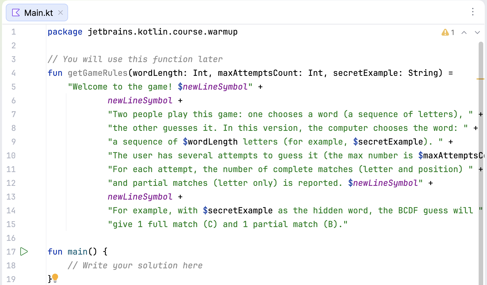

## editor

El **Editor** es tu espacio para programar. Puedes usarlo para experimentar con código mientras trabajas en tareas teóricas y cuestionarios, ya que estos cambios no se revisan.

Para las tareas de programación, utiliza el Editor para modificar el código existente o escribir el tuyo propio desde cero. Este código será revisado cuando envíes tu solución.

Para ejecutar tu código en cualquier momento, selecciona **Ejecutar** en el menú contextual, presiona &shortcut:Run; o haz clic en .

Para volver al Editor y centrarte en tu código, utiliza el comando **Ocultar todas las ventanas** (&shortcut:HideAllWindows;). Para restaurar la disposición anterior, simplemente repite el comando.

