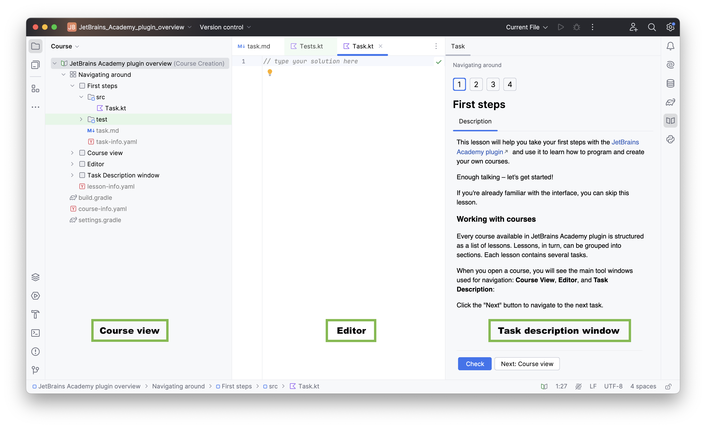

## descripción general del plugin JetBrains Academy

Esta lección te ayudará a dar tus primeros pasos con el [plugin JetBrains Academy](https://www.jetbrains.com/help/education/educational-products.html) y te mostrará cómo utilizarlo para aprender Kotlin.

Con el plugin JetBrains Academy, puedes aprender lenguajes de programación y herramientas completando tareas de codificación y recibiendo retroalimentación instantánea directamente en tu IDE.

Eso es suficiente de teoría: ¡vamos a comenzar!

Si ya estás familiarizado con la interfaz, siéntete libre de omitir esta lección.

### trabajar con los cursos
Cada curso disponible en el plugin JetBrains Academy está estructurado como una lista de lecciones. Las lecciones, a su vez, pueden agruparse en secciones, y cada lección contiene varias tareas.

Cuando abras un curso, verás las principales ventanas de herramientas que se utilizan para la navegación: **Course View**, **Editor** y **Task Description**:

Haz clic en el botón "Next" para navegar a la siguiente tarea.