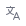
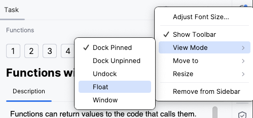

## descripción de la tarea

La ventana de **descripción de la tarea** proporciona toda la información necesaria para completar una tarea:

- Tareas teóricas: Ofrece materiales de aprendizaje y lectura.
- Cuestionarios: Presenta preguntas de opción múltiple.
- Ejercicios de programación: Describe el problema a resolver.

Usa los íconos de la descripción de la tarea para las siguientes acciones:

| Elemento                                                        | Descripción                                                                                                             |
|------------------------------------------------------------------|-------------------------------------------------------------------------------------------------------------------------|
| **Verificar**                                                    | Comprueba la corrección de tu respuesta (para un cuestionario) o de tu solución de código (para una tarea de programación) |
| **Ejecutar**                                                     | Ejecuta tu código (para tareas teóricas)                                                         |
|                                              | Ir a la tarea anterior                                                                           |
|  &nbsp;o **Siguiente** | Ir a la siguiente tarea                                                                      |
|                                             | Descartar todos los cambios realizados en la tarea y empezar de nuevo                            |
|                                       | Dejar un comentario sobre una tarea en particular                                                |
|                                        | Valorar el curso                                                                                 |
| **Obtener pista**                                                | Recibe una pista generada por IA                                                                 |
|                                       | Traduce este curso con IA                                                                        |
|                                      | Cambiar las opciones de visualización de la ventana de descripción de la tarea                   |
|                                    | Ocultar la ventana de descripción de la tarea                                                    |

Recomendamos mantener visible la ventana de descripción de la tarea mientras trabajas. Si resulta demasiado distractora, puedes contraerla haciendo clic en el botón  en la esquina superior derecha.

Si utilizas dos monitores, considera cambiar el panel de descripción de la tarea al modo flotante y moverlo a la segunda pantalla, o simplemente colocarlo cerca de la ventana principal del IDE. Para hacerlo, haz clic en el ícono de configuración de la ventana de herramientas :

